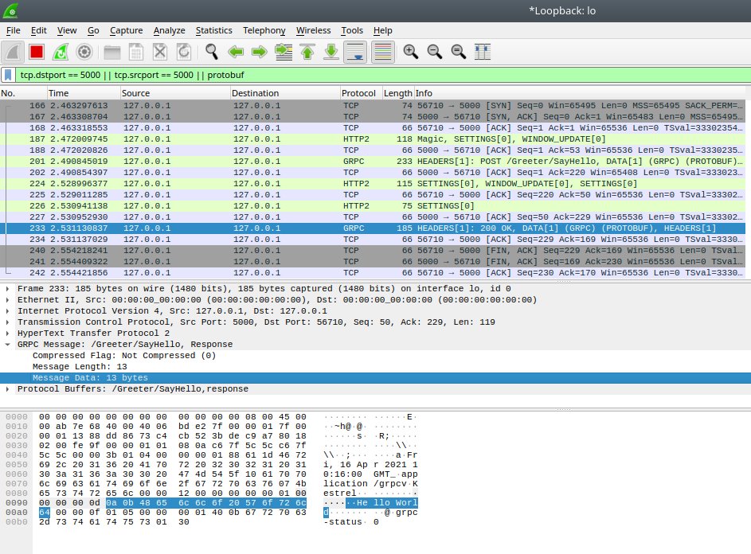

[toc]

## Write protocol file

Example protocol file (greeter.proto):

``` protobuf
syntax = "proto3";

service Greeter {
  rpc SayHello(HelloRequest) returns (HelloReply);
}

message HelloRequest {
  string name = 1;
}

message HelloReply {
  string message = 1;
}
```

## Implement service

### Package references

- Grpc.AspNetCore
- Grpc.Tools

### Add proto file to project

```
<ItemGroup>
  <Protobuf Include="../Protocols/greeter.proto" />
</ItemGroup>
```

### Startup.cs

```c#
    public void ConfigureServices(IServiceCollection services)
    {
        services.AddGrpc();
    }
```

``` c#
    public void Configure(IApplicationBuilder app, IWebHostEnvironment env)
    {
        // ...

        app.UseEndpoints(endpoints =>
        {
            endpoints.MapGrpcService<GreeterService>();
        });
```

### Implement main service file

```c#
public class GreeterService : Greeter.GreeterBase
{
    private readonly ILogger<GreeterService> _logger;

    public GreeterService(ILogger<GreeterService> logger)
    {
        _logger = logger;
    }

    public override Task<HelloReply> SayHello(HelloRequest request, ServerCallContext context)
    {
        _logger.LogInformation("Saying hello to {Name}", request.Name);
        return Task.FromResult(new HelloReply
        {
            Message = $"Hello {request.Name}"
        });
    }
}
```


## Implement client

### Package references

- Google.Protobuf
- Grpc.Net.Client
- Grpc.Tools

### Add proto file to project

```
<ItemGroup>
  <Protobuf Include="../Protocols/greeter.proto" />
</ItemGroup>
```

### Implement client

```c#
  var channel = GrpcChannel.ForAddress("http://localhost:5000");
  var client = new Greeter.GreeterClient(channel);
  
  var response = await client.SayHelloAsync(new HelloRequest
  {
      Name = "World"
  });
  
  Console.WriteLine($"Response from GRPC service: {response.Message}");
```

## Configuring Wireshark to simplyfy analysing GPRC protocol


See: https://grpc.io/blog/wireshark/


1. Setting protobuf search paths: add directory where `.proto` files are located to: Edit -> Preferences -> Protocol -> Protobuf -> SearchPaths -> Add new dir and select “Load all files”
2. Set port traffic type: Analyze -> Decode As -> Add server port (5000 or 5001)  and set Current protocol to `HTTP2`

## Running wireshark

- Select Loopback interface on front screen (if interfaces not listed, re-run wireshark as root)
- Set filter to: 
  ```
  tcp.dstport == 5000 || tcp.srcport == 5000 || protobuf
  ``` 
  (where 5000 is the server port)

A GRPC response will looks like this:

```
Frame 233: 185 bytes on wire (1480 bits), 185 bytes captured (1480 bits) on interface lo, id 0
Ethernet II, Src: 00:00:00_00:00:00 (00:00:00:00:00:00), Dst: 00:00:00_00:00:00 (00:00:00:00:00:00)
Internet Protocol Version 4, Src: 127.0.0.1, Dst: 127.0.0.1
Transmission Control Protocol, Src Port: 5000, Dst Port: 56710, Seq: 50, Ack: 229, Len: 119
HyperText Transfer Protocol 2
GRPC Message: /Greeter/SayHello, Response
Compressed Flag: Not Compressed (0)
Message Length: 13
Message Data: 13 bytes
Protocol Buffers: /Greeter/SayHello,response
```

